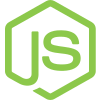
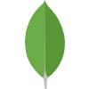
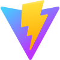

<a href="https://melturham.me">
  <picture>
    <source media="(prefers-color-scheme: dark)" srcset="images/header-dark.svg" />
    
  </picture>
</a>

## About

I'm a **Mid-level Software Engineerr** based in Douala, Cameroon, focused on building practical, reliable, and well-structured digital products. I enjoy turning ideas and requirements into thoughtful user experiences and production-ready software, with an emphasis on clean architecture, maintainability, and attention to detail.

* 💼 **Software Engineer at [HES Digital Service](https://www.hesdigitalservices.com/)**, contributing to web and mobile products used to solve real business and organizational needs.
* 🚀 Built and contributed to products such as [**NEXMA**](https://melturham.me/projects/nexma), a SaaS platform for team and organization management, and [**Multi-Services EG**](https://melturham.me/projects/multi-services-eg), a business platform with an online shop and administration tools.
* 🎓 **Master's in Software Engineering**, Coastal University Institute (IUC), Douala, 2026.
* 🧠 Interested in **software architecture, product development, backend systems, and engineering fundamentals**.
* 🗣️ **French** (native) · **English** (improving)

## Tech stack

<table width="100%">
<tr>
<td align="center" width="12.5%"> TypeScript</td>
<td align="center" width="12.5%"> JavaScript</td>
<td align="center" width="12.5%"> Go (learning)</td>
<td align="center" width="12.5%"> React</td>
<td align="center" width="12.5%"><a href="https://nextjs.org"><picture><source media="(prefers-color-scheme: dark)" srcset="images/stack/nextjs-dark.svg" /></picture></a> Next.js</td>
<td align="center" width="12.5%"> Tailwind CSS</td>
<td align="center" width="12.5%"><a href="https://ui.shadcn.com"><picture><source media="(prefers-color-scheme: dark)" srcset="images/stack/shadcnui-dark.svg" /></picture></a> shadcn/ui</td>
<td align="center" width="12.5%"><a href="https://www.radix-ui.com"><picture><source media="(prefers-color-scheme: dark)" srcset="images/stack/radixui-dark.svg" /></picture></a> Radix UI</td>
</tr>
<tr>
<td align="center" width="12.5%"><a href="https://base-ui.com"><picture><source media="(prefers-color-scheme: dark)" srcset="images/stack/baseui-dark.svg" /></picture></a> Base UI</td>
<td align="center" width="12.5%"><a href="https://motion.dev"><picture><source media="(prefers-color-scheme: dark)" srcset="images/stack/motion-dark.svg" /></picture></a> Motion</td>
<td align="center" width="12.5%"><a href="https://expo.dev"><picture><source media="(prefers-color-scheme: dark)" srcset="images/stack/expo-dark.svg" /></picture></a> Expo</td>
<td align="center" width="12.5%"> TanStack</td>
<td align="center" width="12.5%"><a href="https://zustand-demo.pmnd.rs"><picture><source media="(prefers-color-scheme: dark)" srcset="images/stack/zustand-dark.svg" /></picture></a> Zustand</td>
<td align="center" width="12.5%"> Bun</td>
<td align="center" width="12.5%"> Node.js</td>
<td align="center" width="12.5%"><a href="https://expressjs.com"><picture><source media="(prefers-color-scheme: dark)" srcset="images/stack/expressjs-dark.svg" /></picture></a> Express.js</td>
</tr>
<tr>
<td align="center" width="12.5%"> PostgreSQL</td>
<td align="center" width="12.5%"> MySQL</td>
<td align="center" width="12.5%"><a href="https://www.mongodb.com"><picture><source media="(prefers-color-scheme: dark)" srcset="images/stack/mongodb-dark.svg" /></picture></a> MongoDB</td>
<td align="center" width="12.5%"><a href="https://vite.dev"><picture><source media="(prefers-color-scheme: dark)" srcset="images/stack/vitejs-dark.svg" /></picture></a> Vite</td>
<td align="center" width="12.5%"> Git</td>
<td align="center" width="12.5%"><a href="https://github.com"><picture><source media="(prefers-color-scheme: dark)" srcset="images/stack/github-dark.svg" /></picture></a> GitHub</td>
<td align="center" width="12.5%"><a href="https://zed.dev"><picture><source media="(prefers-color-scheme: dark)" srcset="images/stack/zed-dark.svg" /></picture></a> Zed</td>
<td align="center" width="12.5%"><a href="https://melturham.me"><b>More on melturham.me →</b></a></td>
</tr>
</table>

## What I care about

**Good software is more than working software.** I care about clear architecture, thoughtful UX, reliable systems, and code that remains easy to understand as a product grows.

## Selected work

<table>
<tr>
<td width="50%" valign="top">

### [NEXMA](https://melturham.me/projects/nexma)

A SaaS platform for managing teams and organizations, covering scheduling, contracts, roles, and time tracking.

**[View project →](https://melturham.me/projects/nexma)**

</td>
<td width="50%" valign="top">

### [Diggers & Bandits](https://melturham.me/projects/diggers-and-bandits)

An interactive website for an RC construction experience, featuring a guided multi-step booking flow.

**[View project →](https://melturham.me/projects/diggers-and-bandits)**

</td>
</tr>

<tr>
<td width="50%" valign="top">

### [CITIVA Consult](https://melturham.me/projects/citiva-consult)

A corporate website for a construction and consulting firm, with structured content managed through a CMS.

**[View project →](https://melturham.me/projects/citiva-consult)**

</td>
<td width="50%" valign="top">

### More projects coming

I'm continuously building and experimenting with new products across web, backend, and AI.

</td>
</tr>
</table>

  <a href="https://melturham.me/projects">View all projects →</a>

