

<a href="https://melturham.me">
  <picture>
    <source media="(prefers-color-scheme: dark)" srcset="images/header-dark.svg" />
    
  </picture>
</a>

## About

I'm a **Software Engineer** based in **Douala, Cameroon**, focused on building practical, reliable and well-structured digital products. I enjoy turning ideas and requirements into thoughtful user experiences and production-ready software, with an emphasis on clean architecture, maintainability and attention to detail.

- **Software Engineer at [HES Digital Service](https://www.hesdigitalservices.com/)**, contributing to web and mobile products that solve real business and organizational needs.

- **Front-end developer on [NEXMA](https://melturham.me/projects/nexma)** (web and mobile), a SaaS for managing teams and organizations, and on **[Multi-Services EG](https://melturham.me/projects/multi-services-eg)**, a services business with an online shop and admin dashboard.

- **Master's degree in Software Engineering**, Coastal University Institute (IUC), Douala, 2026.

- **Languages:** French (native) · English (improving)

## Tech stack & tools

<table width="100%">
<tr>
<td align="center" width="10%"><a href="https://www.typescriptlang.org">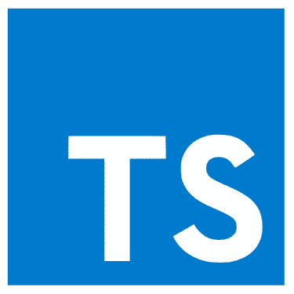</a> TypeScript</td>
<td align="center" width="10%"><a href="https://developer.mozilla.org/docs/Web/JavaScript">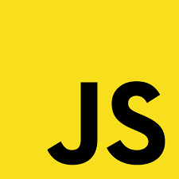</a> JavaScript</td>
<td align="center" width="10%"><a href="https://go.dev">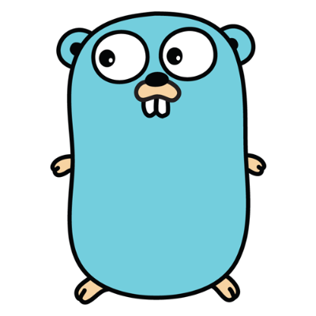</a> Go (learning)</td>
<td align="center" width="10%"> React</td>
<td align="center" width="10%"><a href="https://nextjs.org">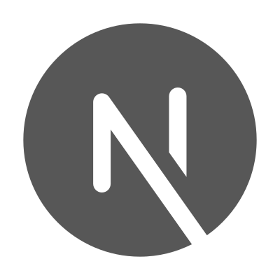</a> Next.js</td>
<td align="center" width="10%"><a href="https://tailwindcss.com">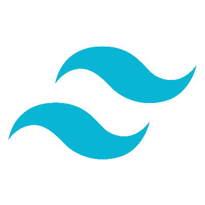</a> Tailwind CSS</td>
<td align="center" width="10%"><a href="https://ui.shadcn.com">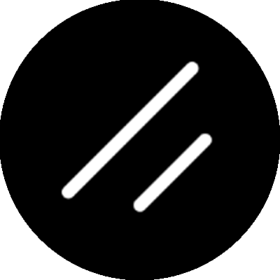</a> shadcn/ui</td>
<td align="center" width="10%"> Expo</td>
<td align="center" width="10%"><a href="https://tanstack.com/query">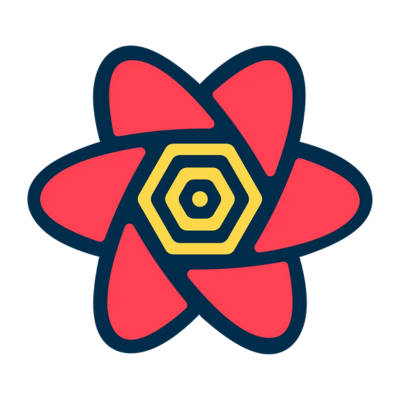</a> TanStack Query</td>
<td align="center" width="10%"> Bun</td>
</tr>
<tr>
<td align="center" width="10%"><a href="https://nodejs.org">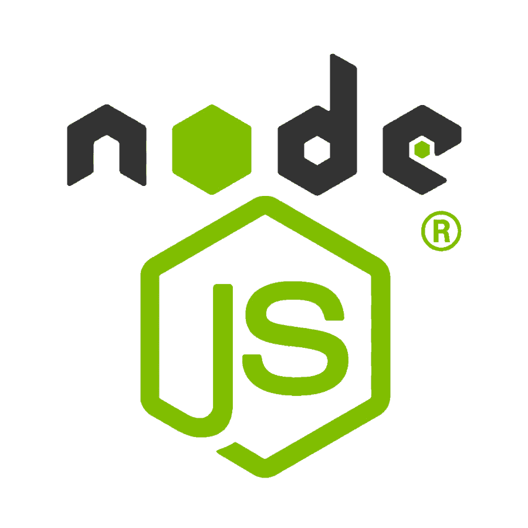</a> Node.js</td>
<td align="center" width="10%"> Express.js</td>
<td align="center" width="10%"><a href="https://www.postgresql.org">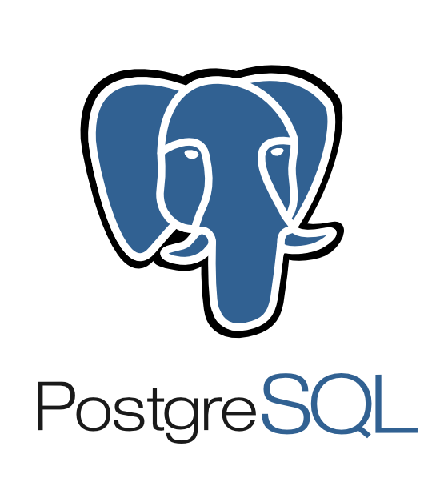</a> PostgreSQL</td>
<td align="center" width="10%"><a href="https://www.mysql.com">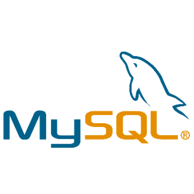</a> MySQL</td>
<td align="center" width="10%"> MongoDB</td>
<td align="center" width="10%"><a href="https://vite.dev">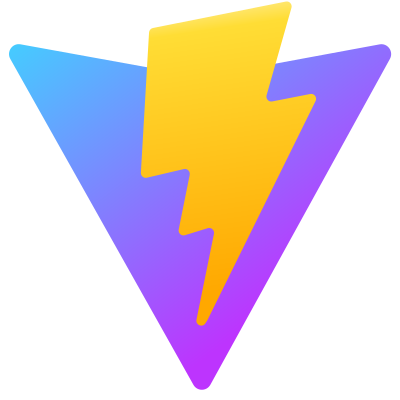</a> Vite</td>
<td align="center" width="10%"><a href="https://git-scm.com">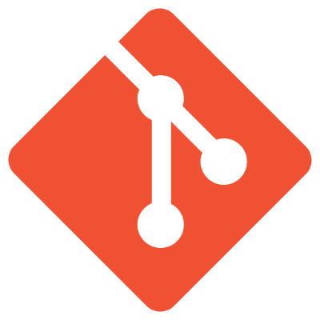</a> Git</td>
<td align="center" width="10%"><a href="https://github.com">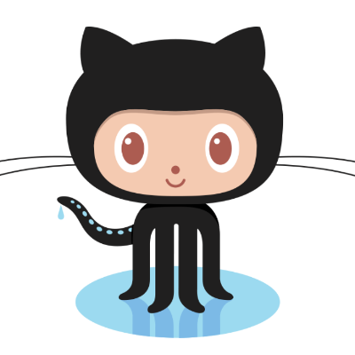</a> GitHub</td>
<td align="center" width="10%"><a href="https://github.com/features/actions">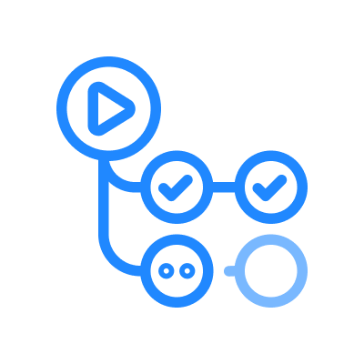</a> GitHub Actions</td>
<td align="center" width="10%"><a href="https://zed.dev">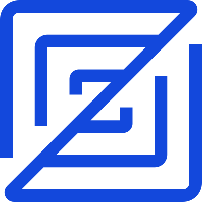</a> Zed</td>
</tr>
</table>

## Selected work

**[NEXMA](https://melturham.me/projects/nexma)** Team and organization management: shared calendar, contracts with task boards, members and roles, time tracking. Next.js · TypeScript · TanStack Query · Zustand · Tailwind CSS

**[Multi-Services EG](https://melturham.me/projects/multi-services-eg)** Cleaning services business: public site, online shop, booking and a full admin dashboard. Next.js · TypeScript · SWR · Zustand · Zod

**[Diggers & Bandits](https://melturham.me/projects/diggers-and-bandits)** RC construction experience with a multi-step booking flow and email confirmations. Next.js · TypeScript · React Hook Form · Zod · Resend

**[CITIVA Consult](https://melturham.me/projects/citiva-consult)** Corporate website for a construction and consulting firm, with content managed in a CMS. Next.js · TypeScript · Sanity

**[View all projects →](https://melturham.me/projects)**

## What I care about

**Good software is more than working software.** I care about clear architecture, thoughtful UX and code that stays easy to understand as a product grows.

I like owning a feature from start to finish: understanding the need, shaping a clean solution, and shipping it reliably to production.

## Currently

Learning **Go** for backend services, and going deeper into **software architecture** and **design patterns**.
